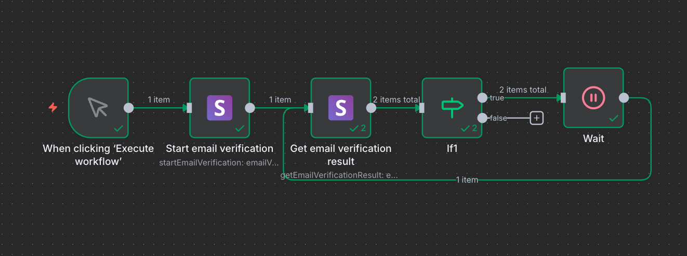
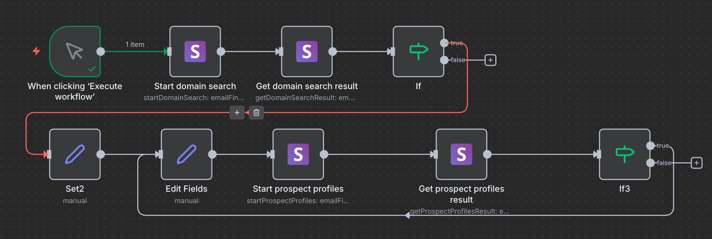
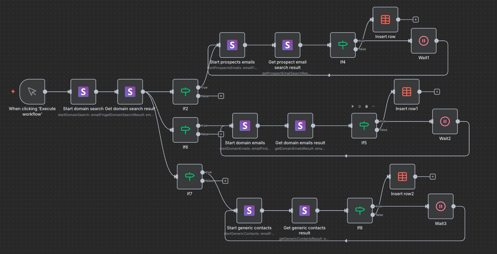

# n8n-nodes-snovio


[](https://www.npmjs.com/package/n8n-nodes-snovio)
[](LICENSE.md)
[](https://n8n.io)
[](https://www.npmjs.com/package/n8n-nodes-snovio)

Official [Snov.io](https://snov.io) integration for [n8n](https://n8n.io)

[Snov.io](https://snov.io) is a B2B email finder, lead generation, email verification, and multi-channel outreach automation platform.

## Table of Contents

- [Prerequisites](#prerequisites)
- [Installation](#installation)
- [Credentials](#credentials)
- [Operations](#operations)
- [Workflow Examples](#workflow-examples)
- [Resources](#resources)
- [Support](#support)
- [License](#license)

## Prerequisites

| Requirement | Details |
|-------------|---------|
| **n8n version** | 0.227.0 or later |
| **Node.js** | v20 or later |
| **Snov.io Account** | Active account with API access - [Sign up](https://app.snov.io) |
| **API Credentials** | User ID and Secret - [Get credentials](https://app.snov.io/account/api) |

**Compatibility:**
- Tested with n8n versions 0.227.0+
- Supports Snov.io API v1 and v2 endpoints
- AI Agent support enabled (usableAsTool: true)
- Works on Linux, macOS, Windows
- Compatible with n8n Cloud, Self-hosted, and Docker deployments

## Installation

Follow the [installation guide](https://docs.n8n.io/integrations/community-nodes/installation/) in the n8n community nodes documentation.

### Community Nodes (Recommended)

1. Go to **Settings** > **Community Nodes**
2. Select **Install**
3. Enter `n8n-nodes-snovio` in the npm Package Name field
4. Agree to the risks of using community nodes
5. Select **Install**

### Manual Installation

```bash
npm install n8n-nodes-snovio
```

After installation, restart your n8n instance.

## Credentials

### Getting API Credentials

1. Log in to your [Snov.io account](https://app.snov.io/account/api)
2. Navigate to **Profile** > **API** > **API & Integrations**
3. Copy your **API User ID**
4. Copy your **API Secret**

### Setting Up in n8n

1. In n8n, open **Credentials** and create new **Snov.io API** credential
2. Enter your **API User ID**
3. Enter your **API Secret**
4. Click **Save** to test the connection

The node uses OAuth 2.0 Client Credentials flow and automatically handles token exchange and refresh.

## Operations

All operations are documented in the [Snov.io API Documentation](https://snov.io/api).

### Email Finder & Data Enrichment

| Operation | Description |
|-----------|-------------|
| [Start Domain Search](https://snov.io/api#DomainSearch2) | Initiate search for company information by domain |
| [Get Domain Search Result](https://snov.io/api#DomainSearch2) | Retrieve results of domain search |
| [Start Prospect Profiles](https://snov.io/api#DomainSearch2) | Search for prospect profiles by domain |
| [Get Prospect Profiles Result](https://snov.io/api#DomainSearch2) | Retrieve prospect profile search results |
| [Start Prospects Emails](https://snov.io/api#DomainSearch2) | Initiate email search for prospects |
| [Get Prospect Email Search Result](https://snov.io/api#DomainSearch2) | Retrieve prospect email search results |
| [Start Domain Emails](https://snov.io/api#DomainSearch2) | Begin domain-wide email discovery |
| [Get Domain Emails Result](https://snov.io/api#DomainSearch2) | Retrieve domain email results |
| [Start Generic Contacts](https://snov.io/api#DomainSearch2) | Search for generic company contacts |
| [Get Generic Contacts Result](https://snov.io/api#DomainSearch2) | Retrieve generic contacts results |
| [Get Domain Emails Count](https://snov.io/api#EmailCount) | Get count of available emails for domain |
| [Start Emails by Domain by Name](https://snov.io/api#EmailFinder) | Find emails by domain and person name |
| [Get Emails by Domain by Name Result](https://snov.io/api#EmailFinder) | Retrieve email search by name results |
| [Start Company Domain by Name](https://snov.io/api#CompanyDomainByName) | Find company domain by company name |
| [Get Company Domain by Name Result](https://snov.io/api#CompanyDomainByName) | Retrieve company domain search results |
| [Start LinkedIn Profile Info From URLs](https://snov.io/api#LiProfilesByUrls) | Extract information from LinkedIn URLs |
| [Get LinkedIn Profile Info From URLs](https://snov.io/api#LiProfilesByUrls) | Retrieve LinkedIn extraction results |
| [Enrich Person Profile From Email](https://snov.io/api#GetProfileByEmail) | Get detailed person info from email |

### Email Verifier

| Operation | Description |
|-----------|-------------|
| [Start Email Verification](https://snov.io/api#EmailVerifier) | Initiate email address verification |
| [Get Email Verification Result](https://snov.io/api#EmailVerifier) | Retrieve verification results |

### Multi-Channel Campaigns

| Operation | Description |
|-----------|-------------|
| [Get Campaign Analytics](https://snov.io/api#GetcampaignAnalytics) | Retrieve campaign performance metrics |
| [View Campaign Progress](https://snov.io/api#ViewcampaignProgress) | Check progress of specific campaign |
| [Change Recipients Status](https://snov.io/api#ChangerecipientsStatus) | Update status of campaign recipients |
| [See List of Completed Prospects](https://snov.io/api#ListOfFinishedProspects) | View prospects who completed campaign |
| [See Campaign Replies](https://snov.io/api#CampaignReplies) | Get all replies from campaign emails |
| [Get Info About Campaign Opens](https://snov.io/api#OpenEmails) | View email open statistics |
| [Check Link Clicks](https://snov.io/api#EmailsClicked) | Track link clicks in campaign emails |
| [View Sent Emails](https://snov.io/api#EmailsSent) | See all emails sent in campaigns |
| [View All Campaigns](https://snov.io/api#UserCampaigns) | List all campaigns |
| [Add to Do Not Email List](https://snov.io/api#AddTODoNotEmailList) | Add emails to exclusion list |

### Prospect Management

| Operation | Description |
|-----------|-------------|
| [Add Prospect to List](https://snov.io/api#AddProspectToList) | Add new prospect to specific list |
| [Find Prospect by ID](https://snov.io/api#FindProspectbyID) | Retrieve prospect details by ID |
| [Find Prospect by Email](https://snov.io/api#FindProspectbyEmail) | Search for prospects by email |
| [Find Prospects Custom Fields](https://snov.io/api#FindProspectsCustomFields) | Get custom fields defined for prospects |
| [See User Lists](https://snov.io/api#SeeUserLists) | View all prospect lists |
| [View Prospects in List](https://snov.io/api#ViewProspectsinList) | Get all prospects from specific list |
| [Create New Prospect List](https://snov.io/api#CreateNewProspectList) | Create new list for prospects |

### User Account

| Operation | Description |
|-----------|-------------|
| [Check User Balance](https://snov.io/api#CheckUserBalance) | View current credit balance |

## Workflow Examples

#### Workflow 1: Email Discovery and Enrichment



Find and enrich contact information from a domain.

**Steps:**
1. Start with domain input
2. Start Domain Search
3. Wait 5-10 seconds
4. Get domain search results
5. Extract prospect profiles
6. Enrich contacts with additional data
7. Save to database or CRM

---

#### Workflow 2: Email Verification Pipeline



Verify email addresses and filter valid contacts.

**Steps:**
1. Import email list from source
2. Start Email Verification for each email
3. Wait for verification processing
4. Get verification results
5. Filter by verification status
6. Export verified emails

---

#### Workflow 3: Complete Lead Generation Pipeline



End-to-end automated lead generation and CRM integration.

**Steps:**
1. Schedule trigger or webhook input with target domains
2. Start domain search for company information
3. Wait for processing
4. Get domain search results
5. Extract prospect profiles from results
6. Start email search for each prospect
7. Wait for email discovery
8. Get prospect emails
9. Verify all discovered emails
10. Filter valid emails only
11. Enrich contact profiles with additional data
12. Add verified prospects to CRM list
13. Send notification about new leads
14. Update dashboard with metrics

---

### Common Use Cases

**Finding Emails by Domain**

1. Add **Snov.io** node, select **Start Domain Search**
2. Enter domain name
3. Add **Wait** node (5-10 seconds)
4. Add **Snov.io** node, select **Get Domain Search Result**
5. Use `task_hash` from previous step

**Verifying Email Addresses**

1. Add **Snov.io** node, select **Start Email Verification**
2. Enter email addresses
3. Add **Wait** node (3-5 seconds)
4. Add **Snov.io** node, select **Get Email Verification Result**
5. Use `task_hash` from previous step

**Enriching Contact from Email**

1. Add **Snov.io** node, select **Enrich Person Profile From Email**
2. Enter email address
3. Execute to get full profile data

**Building Prospect Lists**

1. Add **Snov.io** node, select **Create New Prospect List**
2. Note the `list_id`
3. Add **Snov.io** node, select **Add Prospect to List**
4. Enter prospect details and `list_id`

**Monitoring Campaign Performance**

1. Add **Schedule Trigger** node
2. Add **Snov.io** node, select **Get Campaign Analytics**
3. Add **Snov.io** node, select **See Campaign Replies**
4. Connect to **Slack** or **Email** node for reporting

---

### Best Practices

- Always use **Wait** nodes (5-10 seconds) between Start and Get operations
- Check credits before running bulk operations
- Handle errors gracefully with error workflow branches
- Store `task_hash` for long-running operations
- Validate input data before processing

## Resources

- [n8n Community Nodes Documentation](https://docs.n8n.io/integrations/community-nodes/)
- [Snov.io Website](https://snov.io)
- [Snov.io API Documentation](https://snov.io/api)
- [Snov.io Knowledge Base](https://snov.io/knowledgebase/)
- [n8n Documentation](https://docs.n8n.io)
- [n8n Community Forum](https://community.n8n.io)

## Support

| Type | Contact |
|------|---------|
| Bugs & Issues | [GitHub Issues](https://github.com/devsnovio/n8n-nodes-snovio/issues) |
| Feature Requests | [GitHub Discussions](https://github.com/devsnovio/n8n-nodes-snovio/discussions) |
| Snov.io Support | [help@snov.io](mailto:help@snov.io) |
| Developer Contact | [dev@snov.io](mailto:dev@snov.io) |

## License

[MIT](LICENSE)

Copyright © 2025 snov.io

---

**Built with ❤️ by the Snov.io team**
